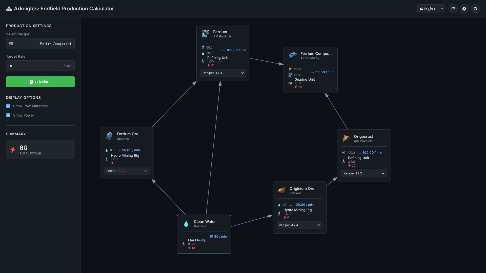

# AKEF-AIC Calculator

A production chain calculator for Arknights: Endfield.

This tool helps you plan and optimize your factory layouts by visualizing the entire production chain, from raw materials to the final product. Calculate the exact resource flow per minute and identify every step in the manufacturing process.

**Live Demo:** [https://micro215.github.io/AKEF-AIC-Calculator/](https://micro215.github.io/AKEF-AIC-Calculator/)

## Key Features

- **Visual Chain Editor:** Intuitive graph-based interface to see the entire production tree at a glance.
- **Real-time Calculation:** Automatically calculates the resource requirements per minute for any production scale.
- **Node Management:** Easily remove any node and its entire production sub-tree to test alternative layouts.
- **Multi-Project Planning:** Use tabs to work on and compare different production chains simultaneously.
- **Session Persistence:** Your work is automatically saved in the browser, so you can close the tab and come back later without losing progress.
- **Production Scaling:** Adjust the desired output (items per minute) to see how resource demands change.
- **Clean & Focused UI:** A distraction-free interface designed for quick analysis and planning.

## How to Use

### 1. Setting Up Your Production Plan

First, you need to choose what you want to produce and set your target output.

-   Click the **"Select Recipe"** button on the left panel. This will open a modal window where you can search, browse by category, and select your desired end product.
-   Once selected, set your production target in the **"Target Speed"** field (e.g., items per minute). The full production chain will be generated automatically.

### 2. Analyzing and Modifying the Chain

With the chain generated, you can analyze its components and make adjustments.

-   **Analyze Nodes:** Each node displays the item's image, name, type, required input/output resources, and the crafting machine needed.
-   **Change Recipes:** If a component has alternative recipes, a dropdown will appear on its node. Select a different recipe to modify the chain.
-   **Recalculate Rates:** After changing recipes, click the **"Calculate"** button to update all production rates and resource requirements across the entire chain.
-   **Remove Components:** You can remove any node, which will also delete its entire production sub-tree. This is useful for testing alternative layouts or excluding certain steps.

### 3. Managing Multiple Projects

You can work on several different production plans at the same time using tabs.

-   The tabs are located at the top of the main panel. You can create new tabs, rename them by double-clicking, and drag them to reorder.

### 4. Customizing the View and Defaults

Tailor the calculator's display to your needs and set your preferred recipes.

-   **Display Options:** Below the main controls, find toggles to show/hide raw materials, energy consumption per node, alternative recipe dropdowns, and a physics simulation for the graph. The total energy consumption for the current plan is displayed here.
-   **Set Default Recipes:** Click the **"Default Recipes"** button to open a window where you can set your preferred crafting alternatives for any item. These defaults will be used whenever a new chain is generated.

### 5. Navigating the Graph

-   **Pan:** Click and drag on an empty area of the background to move the view around.
-   **Zoom:** Use your mouse wheel or trackpad gesture to zoom in and out.
-   **Rearrange:** Click and drag individual nodes to organize the graph layout for better clarity.

## Tech Stack

This is a client-side web application built with:
- HTML5
- CSS3
- Vanilla JavaScript (no frameworks)

## Planned

- Code refactoring

## Contributing

Found a bug, have a suggestion, or want to contribute a translation? Feel free to open an issue on the [Issues page](https://github.com/Micro215/AKEF-AIC-Calculator/issues).

## License

This project is licensed under the MIT License.

## Disclaimer

This is an unofficial fan-made tool. All game data, assets, and item names are the property of Hypergryph. This calculator is based on information from the Arknights: Endfield CBT and is subject to change upon official release.